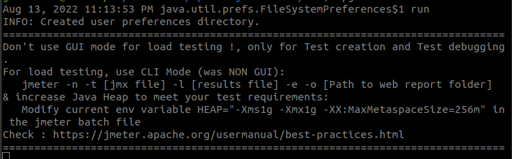

# How to Install Apache JMeter on Ubuntu 20.04

## Step 1 - Install Java

Apache JMeter is a Java-base application. We can install it by running the following commands.

    $ sudo apt-get install openjdk-8-jdk -y

Verify the installed version of Java 

    $ java -version

## Step 2 - Install Apache Web Server

We need to install the Apache web server in our system.

    $ sudo apt-get install apache2 -y

After installing Apache Web Server, we need start  and enable it.

    $ systemctl start apache2

    $ systemctl enable apache2

## Step 3 - Install Apache JMeter

By default, Apache JMeter is not available in the Ubuntu 20.04 default repository. We will need to download it from its official website. We can download it with the following command.

https://jmeter.apache.org/download_jmeter.cgi

We need download the apache-jmeter-version.zip archive. Once downloaded, execute the unzip command.

    $ unzip apache-jmeter-version.zip

## Step 4 - Launch the Apache JMeter Application

Change the directory to the JMeter

    $ cd apache-jmeter-version/bin

Now, start the JMeter application with the command

    $ ./jmeter

Is we can see the following response in our terminal, all the process with be OK.

