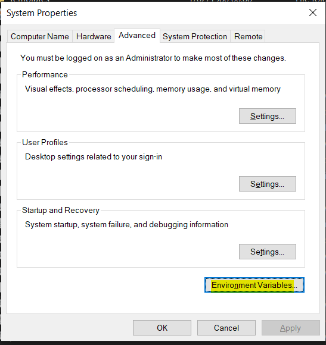
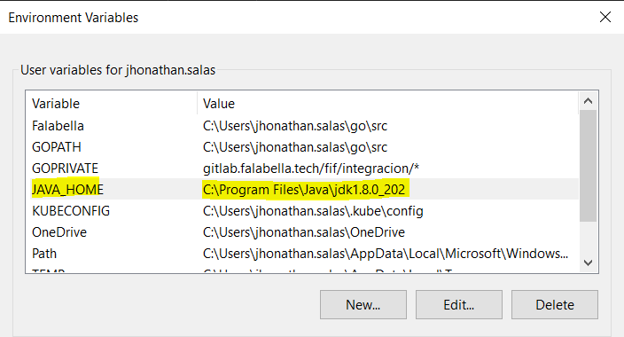
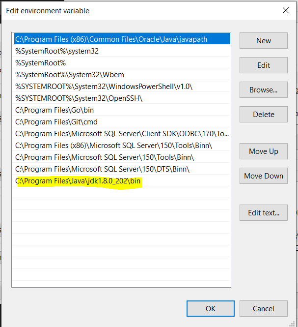
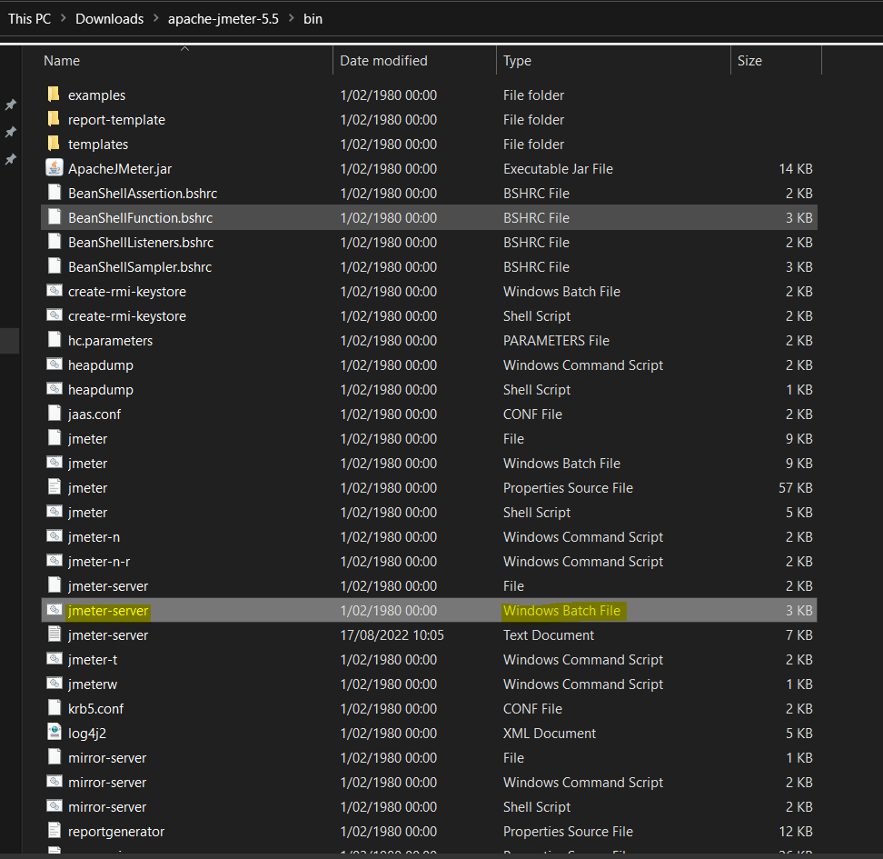
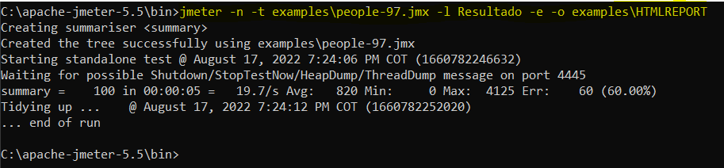

# How to Install Apache JMeter on Windows 10

## Step 1 - Install Java

Download the installer jdl-8u202-windows-x64.exe in the oficial website of Oracle

Execute and contine with the instructions in the installer.

Download the apache-jmeter-5.5

Open System Properties and click on Enviriments Variables

First add the C:\Program Files\Java\jdk1.8.0_202\bin follow the image

Second, add the java rute in the Path

Moved the apache-jmeter-5.5 fold in the rute C:\apache-jmeter-5.5

Enter in the rute C:\apache-jmeter-5.5\bin an execute the archive jmeter

Dentro de la carpeta apache-jmeter-version\bin\examples

Ejecutar

jmeter -n -t examples\archivo.jmx -l NombreArchivoAGenerar -e -o examples\HTMLREPORT

